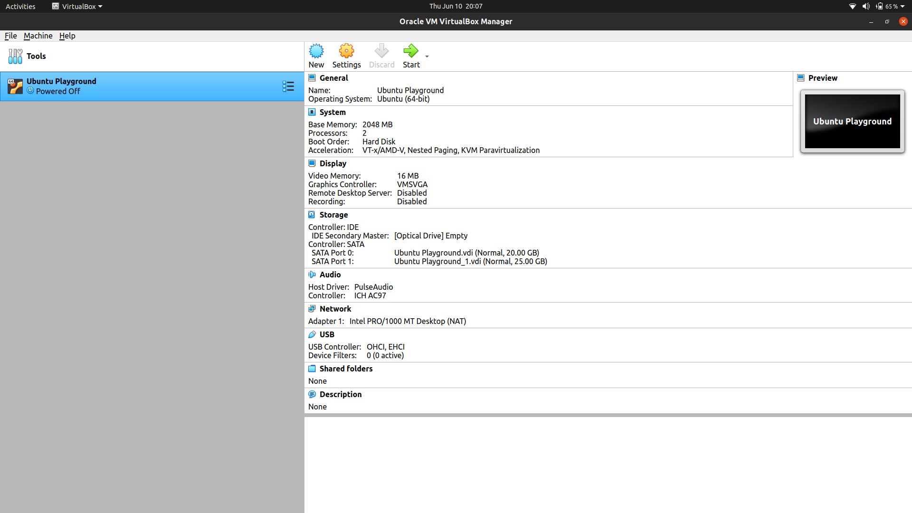
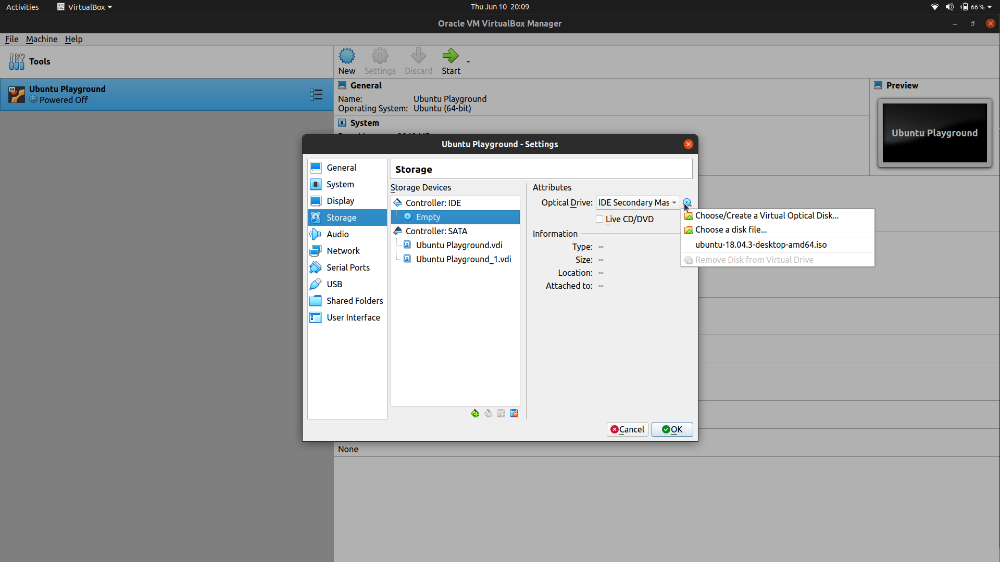
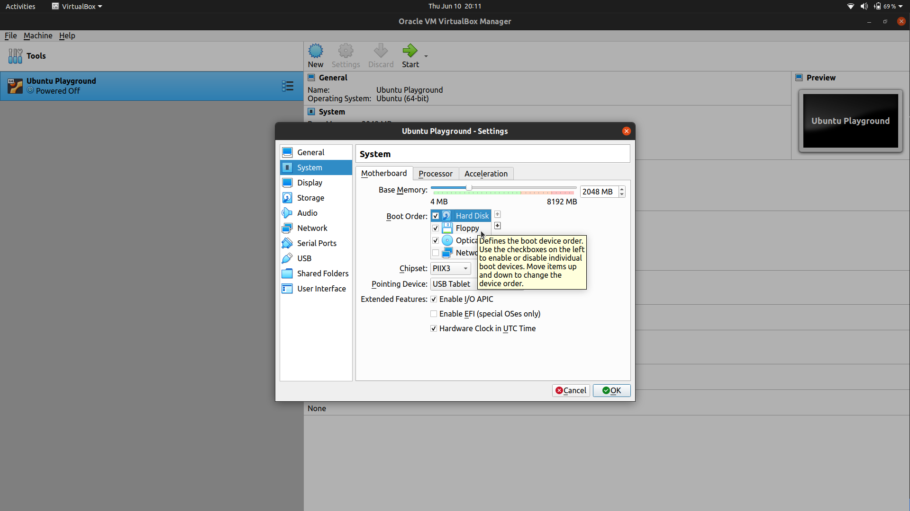

- Install Debian on VM

  - Install Oracle Virtual Box
  - 
  - Download Ubuntu ISO image
  - Create a new VM with default configuration and attach the ISO image to virtual CD Drive
  - 
  - Install the operating system
  - Once installed shutdown the installed VM.
  - Remove the virtual CD or change the priority of the devices so that next time OS boots up instead of again getting the installation process. 
  - 
  - Change the resolution inside the VM -> Settings -> Display -> Resolution 