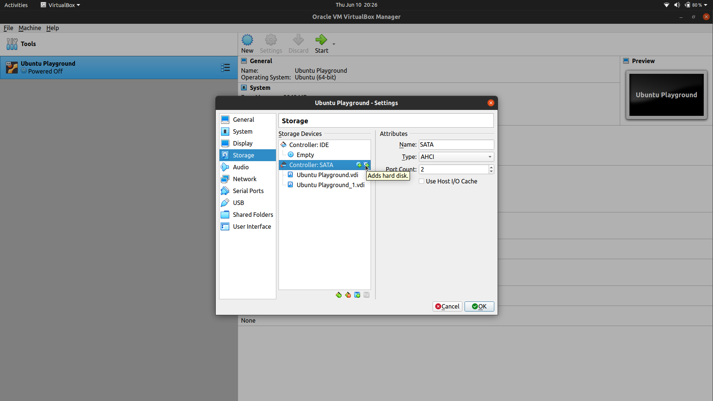

# Add a virtual disk 

- Inside VM add a new Virtual Disk Image
  

`lsblk` List bulk storage devices
`lsblk -f` Along with their file system
`fdisk <path of block storage device>` Manipulate disk parition table

Steps 

- Parition a block storage device using `fdisk`
  - Total primary paritions = 4, because each partition is stored in a 16 byte space and only 64 bytes are alloacted to store partition information. 
  - Use `p` to list current partitions
  - Use `n` to add new partitions
  - Select `start` and `end` sectors for the partition
  - Use `d` to delete partitions
  - Use `w` to save the partition table

- Format the partiton, or specify a filesystem
  - `mkfs.<filesystem> <path to block storage>` is used to format the partition.
  - Eg: `mkfs.ext4 <path to block storage>` to format the partition with `ext4` filesystem.

- Mount the partition to be used
  - `mount <path to block storage> <mounting path>`
  - Use `umount <path to block storage>` to unmount.

